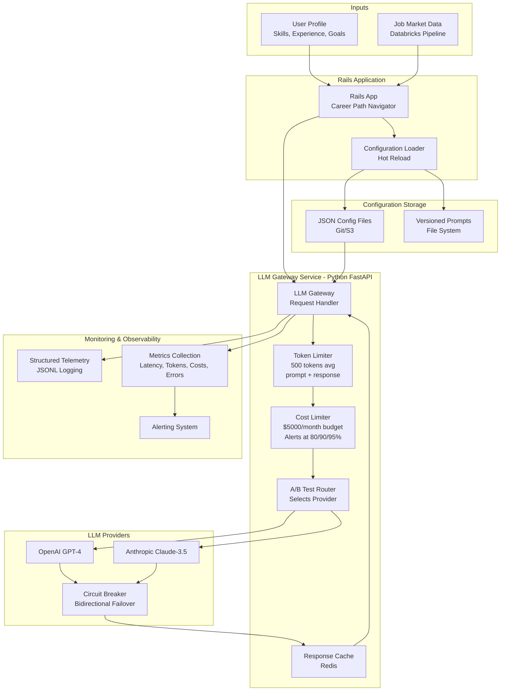

# Career Path Navigator - System Architecture

## Overview

System design for Thrive's Career Path Navigator feature handling 1,000-10,000 requests/day with <3s latency and $5,000/month budget.

## Architecture Diagram

## Components

### 1. Rails Application

- Receives user requests for career path recommendations
- Collects user profile (skills, experience, goals, education)
- Fetches job market data from Databricks pipeline
- Loads configuration via `PromptConfigService` (hot reloading)
- Constructs prompts from versioned templates
- Sends requests to LLM Gateway with metadata
- Formats and returns responses to users

P.S.: The `PromptConfigService` would be a Ruby/Rails service that needs to be built separately. It’s described conceptually but not implemented.

### 2. LLM Gateway Service (Python FastAPI)

- **Token Limiter**: Enforces 500 tokens average (prompt + response combined)
  - Validates requests before sending
  - Tracks running average across all requests
  - Rejects or truncates requests exceeding limit
- **Cost Limiter**: Tracks $5,000/month budget
  - Real-time spending tracking per provider
  - Alerts at 80%, 90%, 95%, and 100% thresholds
  - Throttles or blocks requests when approaching limit
- **A/B Test Router**: Routes requests between providers
  - Configurable traffic splits (e.g., 70% Claude, 30% GPT-4)
  - Sticky sessions for consistency
  - Tracks experiment metadata
- **Response Cache**: Redis-based caching
  - Content-based hashing for similar queries
  - TTL-based expiration (4h exact match, 2h similarity)
  - Reduces costs and improves latency
- **Failover Handler**: Bidirectional circuit breaker
  - GPT-4 ↔ Claude failover
  - Enters fail state after 5 consecutive failures or 50% error rate
  - Auto-recovery after 30 seconds (in-progress state)

### 3. LLM Providers

- **OpenAI GPT-4**: Primary provider for quality
- **Anthropic Claude-3.5-Sonnet**: Cost-effective alternative
- Automatic failover 

### 4. Monitoring & Observability

- **Structured Telemetry**: JSONL logging for each request
  - Timestamp, request ID, provider, model
  - Latency, tokens (input/output/total), cost
  - Success/error status, circuit breaker state
  - Metadata (feature version, prompt version, experiment ID)
- **Metrics Collection**: Aggregated statistics
  - Latency percentiles (p50, p95, p99)
  - Cost tracking per provider
  - Error rates and failure counts
  - Cache hit rates
- **Alerting**: Proactive notifications
  - Budget threshold alerts
  - High error rates
  - Provider outages
  - Latency degradation

### 5. Configuration Storage

- **JSON Configuration Files**: Stored in Git/S3
  - Feature configurations with prompt versioning
  - Provider settings and failover configuration
  - A/B testing experiments
  - Rate limits and budgets
- **Versioned Prompts**: File system storage
  - System prompts: `prompts/career_path_navigator/system/v2.1.txt`
  - User templates: `prompts/career_path_navigator/user/v1.5.txt`
  - Independent versioning from code deployments

## Request Flow

1. **User Request** → Rails app receives request for career path recommendation
2. **Data Collection** → Rails collects user profile and fetches job market data
3. **Configuration Load** → Rails loads active feature config and resolves prompt versions
4. **Prompt Construction** → Rails builds prompt from versioned templates with user data
5. **Token Validation** → Gateway validates request stays within 500 tokens average
6. **Budget Check** → Gateway verifies monthly budget ($5,000) not exceeded
7. **Cache Check** → Gateway checks Redis for cached response
8. **Provider Selection** → Gateway uses A/B test routing to select provider
9. **Circuit Breaker Check** → Gateway verifies selected provider is healthy
10. **API Call** → Gateway makes request to selected provider (with failover if needed)
11. **Response Validation** → Gateway validates response tokens and quality
12. **Cost Recording** → Gateway records actual cost and updates spending
13. **Caching** → Gateway caches response for future similar queries
14. **Telemetry Logging** → Gateway logs structured telemetry data
15. **Metrics Update** → Gateway updates aggregated metrics
16. **Response Return** → Gateway returns formatted response to Rails
17. **User Display** → Rails formats and displays response to user

## Failover Strategy

**Bidirectional Failover**: GPT-4 and Claude are each other's failover. If GPT-4 fails, automatically switch to Claude. If Claude fails, automatically switch to GPT-4.

**Circuit Breaker Logic**:

- **SUCCESS** (normal): Provider is healthy, requests proceed
- **FAIL** (failing): Provider has 5+ consecutive failures or 50%+ error rate
  - All requests failover to backup provider
  - No requests sent to failed provider
- **IN_PROGRESS** (testing): After 30 seconds, test with single request
  - If successful → SUCCESS
  - If failed → FAIL again

**Fallback Hierarchy**:

1. Try selected provider (based on A/B test)
2. If circuit breaker in fail state → failover to backup provider
3. If both providers down → return cached response (even if stale)
4. If no cache → return partial response or error message

## Configuration Management

**Configuration Files** (stored in Git/S3):

- `config/features/career_path_navigator.json`: Main feature configuration
- `config/provider_settings.json`: Provider API keys, models, costs
- `config/ab_test_config.json`: A/B testing experiments and traffic splits
- `config/rate_limits.json`: Rate limits and budget constraints

**Hot Reloading**: Rails `PromptConfigService` watches for config changes and reloads without restart. Enables:

**Versioning**:

- Feature versions: Semantic (1.2.3)
- Prompt versions: Independent (v2.1, v1.5)
- Archived versions stored for quick rollback

## Scaling Considerations

**Initial Scale (1,000 requests/day)**:

- Single gateway instance sufficient
- In-memory caching acceptable
- Direct provider connections

**Target Scale (10,000 requests/day)**:

- Multiple gateway instances with load balancing
- Shared Redis cache cluster
- Connection pooling to providers
- Request queuing during peak traffic
- Horizontal scaling of gateway service

## Key Design Decisions

1. **Separate Gateway Service**: Decouples Rails from LLM providers, enables independent scaling
2. **JSON Configuration**: Simple, version-controlled, no database required
3. **Bidirectional Failover**: Ensures high availability without single point of failure
4. **Aggressive Caching**: Reduces costs and improves latency
5. **Comprehensive Monitoring**: Enables data-driven optimization and quick issue detection
6. **Token & Cost Limiters**: Prevents budget overruns and ensures consistent performance
